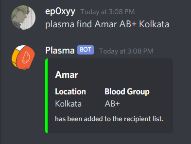

# Find Plasma Online

## About

UB Hacking Project 2020 (University at Buffalo Hackathon)

## Developers:

- Shreevardhan Shah
- Rohitashwa Pareek

## About the bot

**Find Plasma Bot** is a discord bot designed to assist the community to help each other in today's COVID-19 crysis. Compatible donors can share their info and thus help out patients who are in need of blood plasma for recovering from the virus. Recipients can add requests and automatically get the information of compatible donors from the server, right into their DM.

## Screenshots
### ```plasma h``` (help command)

### ```plasma find```(find plasma donors command)

### The bot responds in a DM


## Tools Used

- _Python_ - Used the [discord.py API Wrapper](https://discordpy.readthedocs.io/en/latest/) for developing the bot and _Pandas_ for data management.
- _HTML, CSS, Bootstrap_ - For making the landing page

## How to run

Clone the package and edit the token in `bot.py` by changing the line 172 and replacing the token in
`client.run('<token>')` with your own bot token and then running the script.
